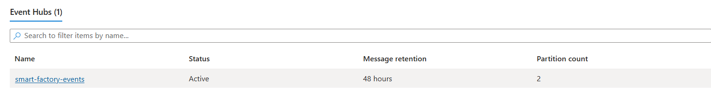
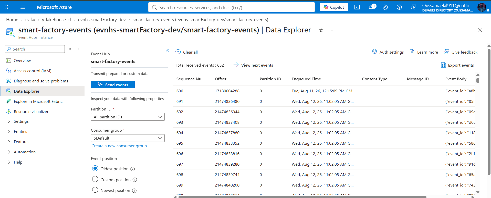
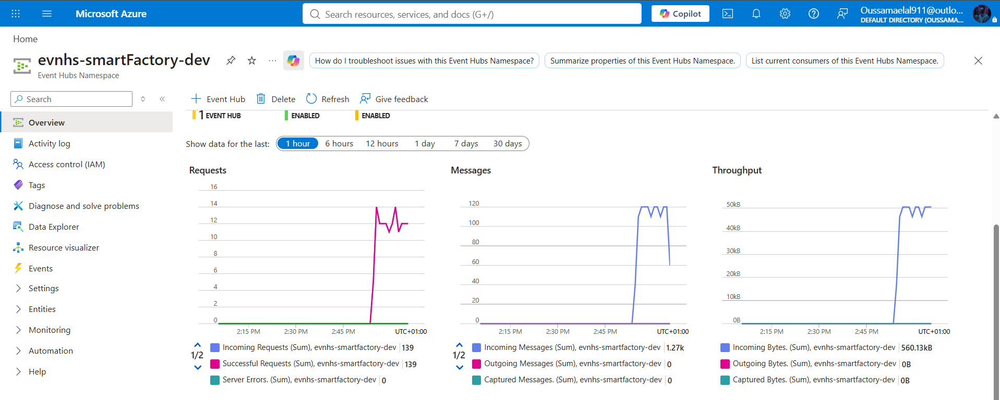
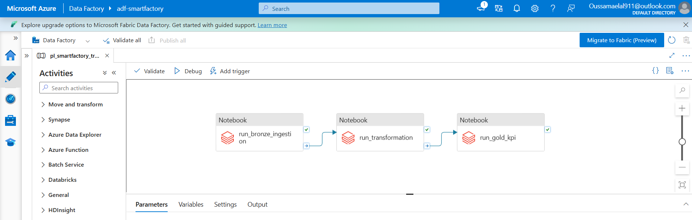
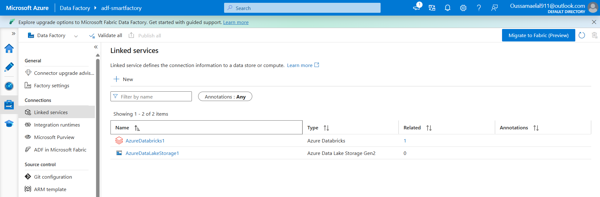
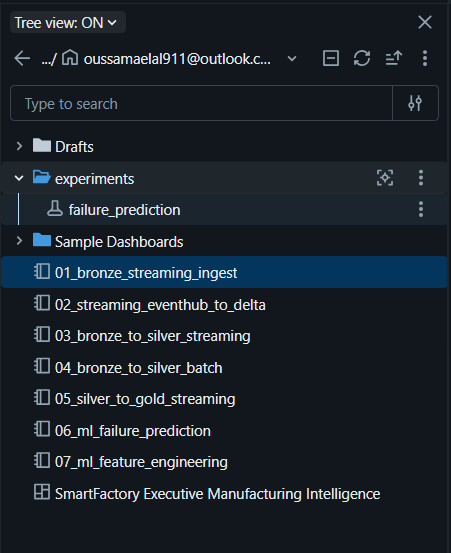
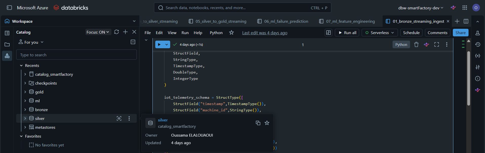
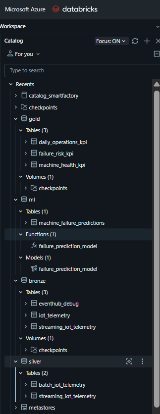
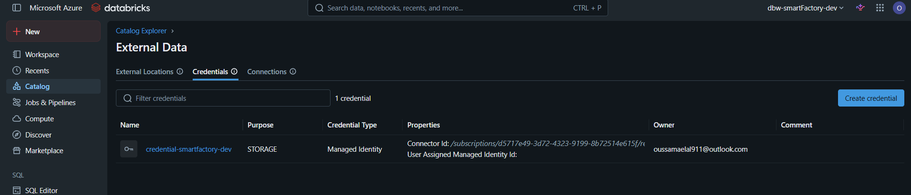
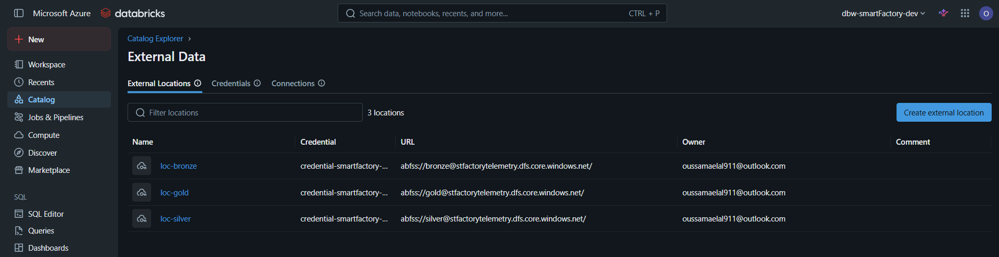

# Azure Infrastructure

## 1. Overview

The Smart Factory Data Platform is deployed on Microsoft Azure using several managed cloud services.

The Azure infrastructure provides the storage, messaging, orchestration, processing, and identity components required by the platform.

The main Azure services used are:

| Azure Service                | Role in the Project                         |
| ---------------------------- | ------------------------------------------- |
| Azure Resource Group         | Organizes and manages the project resources |
| Azure Data Lake Storage Gen2 | Persistent data lake storage                |
| Azure Event Hubs             | Real-time telemetry ingestion               |
| Azure Data Factory           | Pipeline orchestration                      |
| Azure Databricks             | Data processing and analytics               |
| Microsoft Entra ID           | Authentication and authorization            |

The project was developed using an Azure for Students subscription and therefore uses managed/serverless services where possible to minimize infrastructure management and cost.

---

## 2. Resource Group

All project resources are organized within an Azure Resource Group.

The Resource Group provides a single management boundary for the Smart Factory project.

It allows the resources to be:

* Managed together
* Monitored together
* Access-controlled together
* Deleted together when the project is completed

### Screenshot


### Resource Group

**Name:** `rs-factory-lakehouse-cf`

**Purpose:** Contains the Azure resources used by the Smart Factory platform.

---

# 3. Azure Data Lake Storage Gen2

## 3.1 Purpose

Azure Data Lake Storage Gen2 is the main persistent storage layer of the project.

The storage account used by the project is:

```text
tfactorytelemetry
```

It stores the data generated and processed by the Smart Factory platform.

The data lake follows a medallion-style organization:

```text
ADLS Gen2
│
├── Bronze
├── Silver
└── Gold
```

---

## 3.2 Data Stored in ADLS

The project contains several factory-related datasets, including:

* Telemetry
* Machines
* Maintenance
* Quality
* Deliveries
* Suppliers

The Bronze layer contains the ingestion-level data used as the starting point for downstream processing.

### ADLS structure


### Bronze files


---

# 4. Azure Event Hubs

## 4.1 Purpose

Azure Event Hubs provides the real-time ingestion layer for machine telemetry.

The telemetry generator continuously produces machine events and sends them to Azure Event Hubs.

The logical flow is:

```text
Telemetry Generator
        │
        ▼
Event Hub Namespace
        │
        ▼
Event Hub
        │
        ▼
Databricks Structured Streaming
```

---

## 4.2 Event Hub Namespace

**Namespace:** `evnhs-smartFactory-dev`

The namespace provides the Event Hubs infrastructure required by the streaming pipeline.

### Screenshot



---

## 4.3 Event Hub

**Event Hub:** `smart-factory-events`

The Event Hub is the specific event stream receiving machine telemetry.

### Screenshot



---

## 4.4 Incoming Telemetry

The incoming telemetry monitoring view provides evidence that the telemetry producer successfully sent events to Event Hubs.

### Screenshot



This confirms the communication between the telemetry producer and the Azure Event Hubs ingestion layer.

---

# 5. Azure Data Factory

## 5.1 Purpose

Azure Data Factory is used as the orchestration layer of the batch processing workflow.

The Data Factory pipeline coordinates the execution of Databricks notebooks in a defined sequence.

The Data Factory instance shown in the project is:

```text
adf-smartfactory
```

---

## 5.2 Pipeline

The main pipeline executes three Databricks notebook activities:

```text
run_bronze_ingestion
        │
        ▼
run_transformation
        │
        ▼
run_gold_kpi
```

Each stage is connected to the next so that the downstream stage executes after the successful completion of the previous stage.

### Pipeline screenshot



---

## 5.3 Linked Services

Azure Data Factory uses linked services to define connections to external services used by the pipeline.

### Screenshot



The exact connection configuration should be taken from the final Data Factory environment.

Credentials and secrets must not be committed to the repository.

---

# 6. Azure Databricks

## 6.1 Purpose

Azure Databricks is the main data processing and analytics environment.

It is responsible for:

* Data ingestion
* Spark processing
* Data transformations
* Structured Streaming
* Bronze/Silver/Gold processing
* KPI generation
* Analytics

### Screenshot



---

## 6.2 Compute

The project uses **Databricks Serverless Compute**.

No user-managed Spark cluster was configured.

Therefore, there is no project-specific worker/driver VM configuration to preserve.

Serverless Compute was appropriate for the project because it removes the need to manually provision and manage Spark infrastructure.

---

# 7. Unity Catalog

Unity Catalog is the governance and data organization layer used within Databricks.

It provides centralized management of the project's:

* Catalogs
* Schemas
* Tables
* Storage credentials
* External locations

### Catalog overview



### Catalog structure



The exact catalog and schema names should be preserved from the final Databricks environment.

---

# 8. Storage Credentials

A Unity Catalog storage credential is used to establish authorized access to the configured cloud storage.

### Screenshot



The documentation should preserve:

* Credential name
* Authentication mechanism
* Associated identity
* Purpose

It must **not** contain:

* Client secrets
* Passwords
* Access tokens
* Private keys
* Connection strings containing secrets

---

# 9. External Locations

Unity Catalog external locations provide governed access to storage paths in ADLS Gen2.

### Screenshot



The logical relationship is:

```text
Storage Credential
        │
        ▼
External Location
        │
        ▼
ADLS Gen2
```

Before deleting the Azure resources, record the exact:

* External location names
* ADLS paths
* Associated storage credentials

This information will be useful if the project is reconstructed later.

---

# 10. Azure Resource Inventory

Before deleting the temporary Azure environment, the following inventory should be completed with the exact resource names.

| Resource             | Type                 | Purpose                     | Name                |
| -------------------- | -------------------- | --------------------------- | ------------------- |
| Resource Group       | Azure Resource Group | Project resource management | `rs-factory-lakehouse-cf`      |
| Storage Account      | ADLS Gen2            | Data lake                   | `tfactorytelemetry` |
| Event Hub Namespace  | Azure Event Hubs     | Streaming infrastructure    | `evnhs-smartFactory-dev`      |
| Event Hub            | Azure Event Hubs     | Telemetry ingestion         | `smart-factory-events`      |
| Data Factory         | Azure Data Factory   | Pipeline orchestration      | `adf-smartfactory`  |
| Databricks Workspace | Azure Databricks     | Processing and analytics    |       |
| App Registration     | Microsoft Entra ID   | Authentication              | `ap-smartfactory`      |

---

# 11. Resource Dependencies

The main Azure dependencies can be summarized as:

```text
                    Resource Group
                          │
        ┌─────────────────┼──────────────────┐
        │                 │                  │
        ▼                 ▼                  ▼
     ADLS Gen2       Event Hubs        Data Factory
        │                 │                  │
        │                 │                  ▼
        │                 │            Databricks
        │                 │                  │
        │                 └──────────────────┤
        │                                    │
        └────────────────────────────────────┘
                                             │
                                             ▼
                                      Unity Catalog
```
